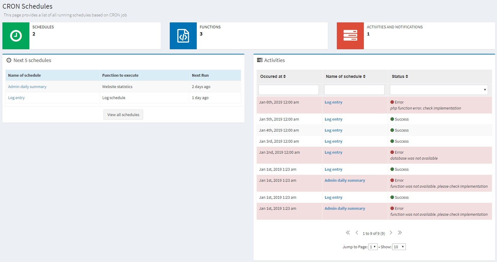
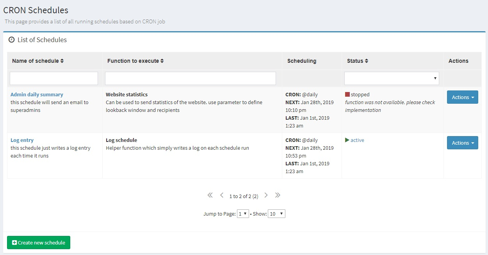
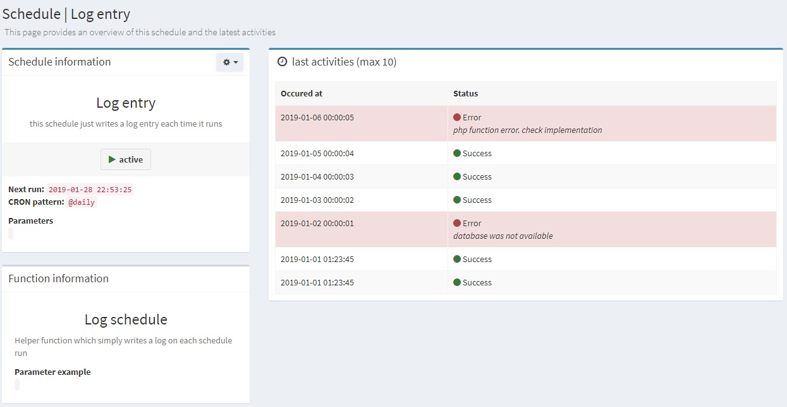
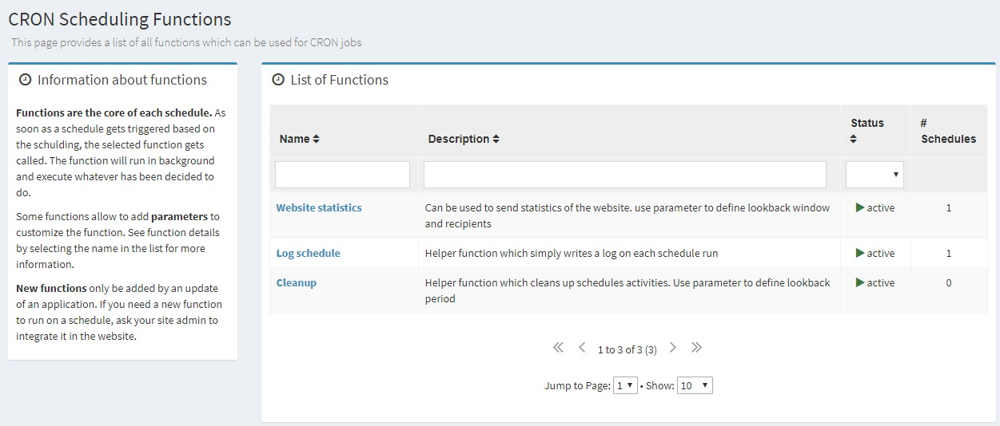
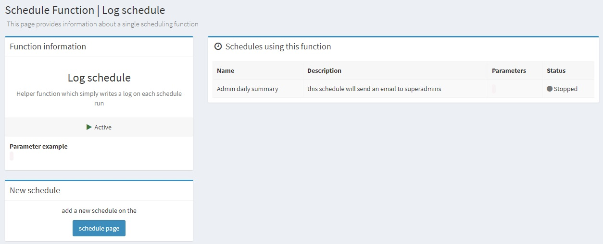

# Task Scheduling Sprinkle for [UserFrosting 4](https://www.userfrosting.com)
This Sprinkle provides a framework to add schedule functions to UserFrosting similar to CRON jobs.
But instead of adding each function to CRON, you simply setup one CRON job which triggers the script. 
The main idea is that you can manage all schedules in the admin interface of userfrosting.

# Important: BETA version - initial work in progress
the current code is still beta and might change without managing any migration or dependencies.
that means if you use this sprinkle you do it at your own risk!
(be sure I will try to keep it as stable as possible but can't guarantee...)

## Current work
this is just an open list of current tasks I'm working on
- add permissions and change whole code to respect the functions
- add language files at least in english and german, can be extended if somebody needs more
- run a lot of tests on live environment to find the bugs ... or not :)

## Future improvements
following some ideas that came up while writing the code
-  <strong>Schedule plan:</strong> in current setup the scheduling (next run, last activity id) is saved in the schedule itselfs. 
while this is convenient for easy querying there are some drawbacks, especially the "schedule update" on each run.
It might be better to have the scheduling (next run) as open activity in the activities table. 
Changing the setup would have a full rewrite of the code
- <strong>Parallel runs:</strong> Currently the schedule worker takes the open schedules one by one. 
while this might be ok if you have just a small amount of schedules, but might be a bad idea for larger projects.
Eg. if you have a schedule which takes a lot of time, everything else is stopped meanwhile...
maybe there is an easy way to start the functions in parallel, adding some "priority" to schedules...
- <strong>Performance management:</strong> So far I did no performance testing on the scheduling job. 
maybe there is a way to restrict the available memory for the schedules to not have any impact on the frontend users
- <strong>Timezones:</strong> currently the whole scheduling is based on the server timezone. 
for larger projects it might be better to have a scheduling based on timezones which would allow a better performance management
(eg. less impact for frontend users if you perform the schedules at night)

## Help and Contributing

If you find any bug, feel free to open an issue or better submit a pull request. 

# Installation

Following some information to get the scheduler up and running<p>

## Dependencies
The sprinkle has the following dependencies
- [dragonmantank/cron-expression](https://github.com/dragonmantank/cron-expression) is used for easy scheduling management
- [symfony/lock](https://github.com/symfony/lock) is used to manage overlapping of schedules, see [Documentation](https://symfony.com/doc/master/components/lock.html)
- [lcharette/UF_FormGenerator](https://github.com/lcharette/UF_FormGenerator) for create/edit/delete schedules in the interface

## Requirements
because of the dependencies there are some requirements to be aware of before you can use this sprinkle
- PHP 7.0+ required for [dragonmantank/cron-expression](https://github.com/dragonmantank/cron-expression)
- UserFrosting 4.1.x for [lcharette/UF_FormGenerator](https://github.com/lcharette/UF_FormGenerator) 

# Installation
Edit UserFrosting `app/sprinkles.json` file and add the following to the `require` list : 

- `"lcharette/uf_formgenerator": "^2.0.0"`. Also add `FormGenerator` to the `base` list. 
- `"ursboller/uf_scheduler": "^1.0.0"`. Also add `Scheduler` to the `base` list. 

For example:

```
{
    "require": {
        "lcharette/uf_formgenerator": "^2.0.0",
        "ursboller/uf_scheduler": "^1.0.0"
    },
    "base": [
        "core",
        "account",
        "admin",
        "FormGenerator",
        "Scheduler"
    ]
}
```

Run `composer update` then `php bakery bake` to install the sprinkle.

# The scheduler
Before we dig into the single settings and functions from the scheduler a short description how the scheduler works.

## The idea
While cron jobs are available on most systems it is hard to manage them since you would need to have console access to get it up and running.
Therefore the idea came up to use something similar to [Task Scheduling - Laravel](https://laravel.com/docs/5.7/scheduling) but with a nice backend interface.
It would be perfect if all users with permission can manage single tasks.<p>
Thanks to the UserFrosting Team which gave me some help the scheduler uses the bakery command which allows to work within sprinkles. 
beeing in the framework allows to use all the features that are available in the application anyway, its just a simple sprinkle really similar what you would find somewhere else.

## Starting the cron schedule
When using the scheduler, you only need to add the following Cron entry to your server. If you do not know how to add Cron entries to your server, consider using a service such as Laravel Forge which can manage the Cron entries for you:

```* * * * * cd /path-to-your-project && php bakery schedule >> /dev/null 2>&1```
<br>This cron will call the scheduler every minute. When the `schedule` command is executed, the scheduler will evaluate your scheduled tasks and runs the functions that are due.

## Features 










## Routes
...

# Permission management
There is just a simple permission management which contains the main roles on a high level. 
since it is not the idea that every user can manage those schedules, there is no need to have more permissions.
## overview
this table should give a short overview of permission slugs and what users can do. the description of the single 
<table>
    <tr>
        <th align="left">slug</th>
        <th>view</th>
        <th>create/modify</th>
        <th>view hidden</th>
        <th>modify hidden</th>
    </tr>
    <tr>
        <td>see_schedules</td>
        <td align="center">X</td>
        <td></td>
        <td></td>
        <td></td>
    </tr>
    <tr>
        <td>edit_schedules</td>
        <td align="center">X</td>
        <td align="center">X</td>
        <td></td>
        <td></td>
    </tr>
    <tr>
        <td>see_schedules_hidden</td>
        <td align="center">X</td>
        <td></td>
        <td align="center">X</td>
        <td></td>
    </tr>
</table>

## slug `see_schedules`
User with this permission can see everything what is available for public within the scheduler. 
They can not see the hidden schedules and they can not modify or create any schedules.
Use this permission if you want to show a user the scheduling without allowing any modifications

## slug `edit_schedules`
This permission allows to modify the public schedules (including delete) as well as creating new schedules.
Give this permission to users who understand what the functions are doing and how they can customize the functions.

## slug `see_schedules_hidden`
Based on the idea from [Louis Charette](https://github.com/lcharette) there is an option to add schedules which can not be edited in any way.
that means they are implemented by migration and can only be started/stopped on the command line.
But since there is a nice interface, why not show any information about those hidden jobs? 
Use this permission for admins who need to keep an eye on the hidden schedules

# Advanced usage

## how the scheduler works

## add own scheduling functions

## hidden schedules

## setup new function class

## setup migration

## use scheduler on command line

# Running tests

currently there are no built in tests for this sprinkle. you use it at your own risks so please do a propper testing yourself!


# Licence

By [Urs Boller](https://github.com/ursboller). Copyright (c) 2019, free to use in personal and commercial software as per the MIT license.
